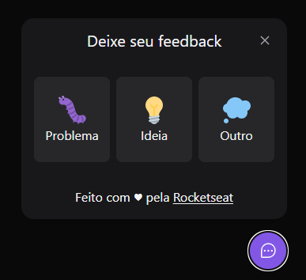
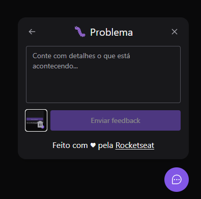
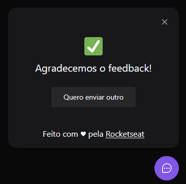

  

Project developed at NLW Return 🚀

Go check it out: <a href="https://feedget-4cttv6k9w-k4me.vercel.app/"> Feedget </a>

## 👀 Images

  
  
  

## 🔖 Layout

You can view the project layout through the link below:

- [Feedback Widget - Figma](https://www.figma.com/community/file/1102912516166573468)

Remembering that you need to have a [Figma](http://figma.com/) account to access it.

## 🚀 Technologies

- [ReactJS](https://reactjs.org/)
- [Tailwind CSS](https://tailwindcss.com/)
- [TypeScript](https://www.typescriptlang.org/)
- [Vitejs](https://vitejs.dev/)
- [Express](https://expressjs.com/)

## 💻 Getting started

First, clone de project:

    git clone git@github.com:K4ME/feedget-web.git

Install the dependencies

    npm install

Run the code

    npm run dev

<!--
<strong>Criar o projeto:</strong>
npm create vite@latest

<strong>Instalar dependências:</strong>
npm install

<strong>Instalar tailwindcss no projeto:</strong>
https://tailwindcss.com/docs/installation/using-postcss

<strong>Instalar icones:</strong>
npm install phosphor-react

<strong>Instalar compoenents headlessui:</strong>
npm install @headlessui/react

<strong>Instalar tailwindcss/forms:</strong>
npm install -D @tailwindcss/forms

<strong>Instalar tailwindcss scrollbar</strong>
npm install --save-dev tailwind-scrollbar

<strong>Instalar biblioteca para screenshot:</strong>
npm install html2canvas -->

---

  Made with 💜 by <a href="https://www.linkedin.com/in/guilhermemacrini/">Guilherme Macrini</a>

